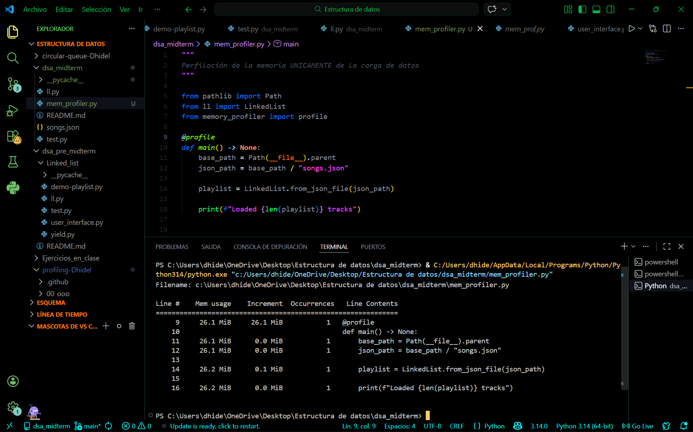
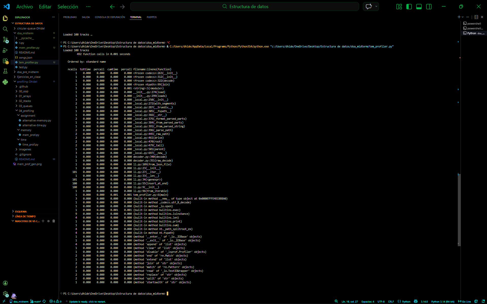
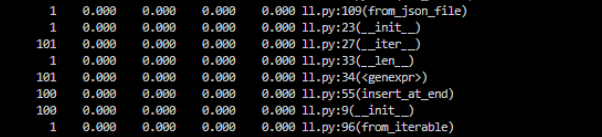

# dsa_midterm
Examen parcial de estructura de datos

1. Profiling
    - Memory-profiler:
        Utilicé memory_profiler, en el archivo mem_profiler lo cuál me dio la siguiente tabla
        
        Aquí podemos observar que la carga es casi inexistente, solamente de 0.1 MiB. Lo cuál no es una cantidad que represente un peso real a pesar de la cantidad de datos.

    - Temporal-profiler:
        Para el temporal utilicé cprofile, al igual que en el entregable del tema, fue utilizado en el archivo tem_profiler y me dió la siguiente tabla
        
        Pero realmente de todo lo que sale aquí lo que realmente nos importa es lo siguiente:
        
        Pues es aquí donde están los archivos que realmente nos interesa. Esta parte específica nos explica que, al igual que la memoria, el tiempo es casi insignificante, de hecho, en la captura, solo salen 0s, porque el tiempo de espera es mucho menor.

2. Shuffle
    - El shuffle funciona con la opción de activar y desactivar, si tengo una lista funciona normal, como linked list, cuando se activa se cambia a una lista aleatorea que se reproduce, y cuando se apaga vuelve a la lista original que funciona normal.
    - Es de complejidad temporal, pues la lista será aleatorea hasta la cantidad de canciones que haya en posible uso, entonces si hay 3 canciones no será lo mismo que si hay 3000, por eso es O(n). 

3. Clonar
    - Pueden clonar el repo de manera normal, para probar cada perfilamiento pueden ingresar al archivo de su respectivo nombre, para probar el shuffle también pueden ingresar a ese archivo especifico y correrlo. es un ejemplo básico que muestra el funconamiento. Solo asegurarse que están en las rutas correctas porque me tiró un error por correr los ejemplos sin estar en esa ruta especifica.